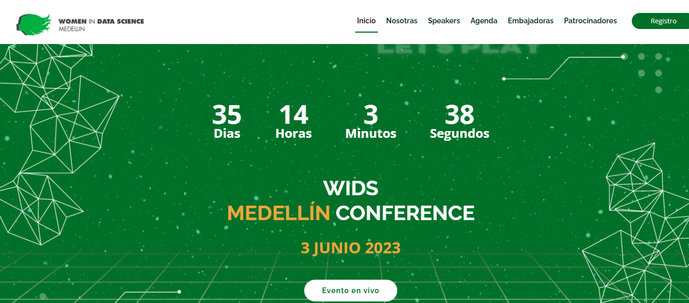

# wids_med_2023

## Descripción del proyecto

Creacion de pagina del evento de WiDS Medellín 2023 que es un evento independiente organizado por la organización WiDS Ambassador de Medellín Colombia como parte de la conferencia anual WiDS Worldwide, el WiDS Datathon, y un estimado de 200 Eventos Regionales WiDS en todo el mundo.

## Contribución
Estos son las embajadoras que apoyaron en la elaboracion de la pagina web-Wids 2023.

<table>
  <tr align=""center>
    <td align="center"><a href="https://www.linkedin.com/in/yemasu-perez/"> <b>Amelia Perez </b></a> <a href="https://www.linkedin.com/in/yemasu-perez/">Data Scientist👩‍💻</a></td>
    <td align="center"><a href="https://www.linkedin.com/in/oriana-osorio-14a37b56/" title="Rocketseat"> <b>Oriana Osorio</b></a> <a href="https://www.linkedin.com/in/oriana-osorio-14a37b56/" title="Rocketseat" title="Rocketseat">
    Data Scientist👩‍💻</a></td>
    <td align="center"><a href="https://www.linkedin.com/in/rina-plata/"> <b>Rina Plata</b></a> <a href="https://www.linkedin.com/in/rina-plata/" title="Rocketseat">Web developer👩‍💻</a></td>
  </tr>
  <tr>
</table>
